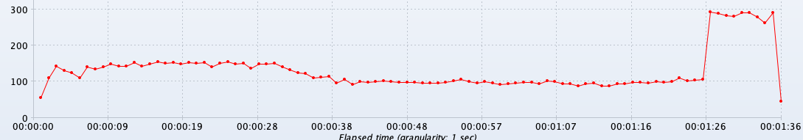
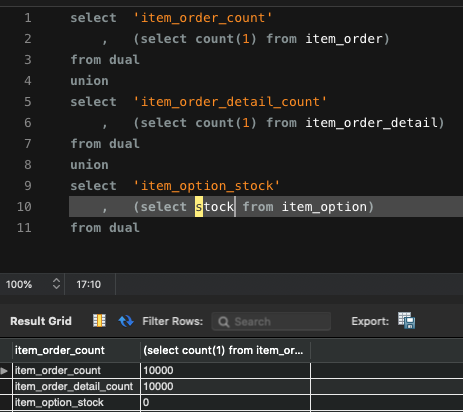

# 1일차
기존에 있던 프로젝트를 급히 마무리하고, 새로운 프로젝트를 시작.  
먼저 Spring Security 적용, Redis 적용을 마무리 했고, JPA도 설정을 해놓고 스키마 셋팅완료.  
다음 일차는 전날차에 계획하기로 했다.    
# 2일차
## 계획
1. 카테고리(Category) Depth형태로 구현
2. 상품(Item) 객체 생성  
3. 리뷰(ItemReview) 객체 생성
4. 3일차 작성
## 회고
테스트 코드를 짜는데 JPA Repository를 Mock으로 등록이 가능할것 같은데.  
아직 잘 모르겠다.  
Review 테스트코드를 등록하려면 Category, Item을 먼저 등록해줘야하고..  
방법을 찾아봐야겠다
# 3일차
1. 2일차 회고 찾아보기
2. 카테고리에 있는 필드 채우기
3. 상품에 있는 필드 채우기
4. 리뷰에 있는 필드 채우기
5. 4일차 작성

## 회고
Service Layer는 다른 Layer를 침범해서는 안될것 같은데 이미 나는 침범하고 있는것 같다.  
2일차때 짠 테스트코드는 Repository 테스트코드가 맞는것 같다.  

# 4일차
주말이 끼어서 많이는 하지 못할것 같다.  
1. 2일차때 테스트코드 수정 + 3일차 테스트코드 작성
2. 장바구니 추가 (basket)
3. 옵션 추가 ( 1 : 0..1 ) ( review, item )
4. 5일차 작성

## 회고
review에는 옵션이 필요 없다.  
구매내역을 OTO 할것인데 필요할리가 없다.  
나중에 되면은 구매내역에 있는 Item도 제거할 이유가 있을것 같다.  

# 5일차
1. 주문내역 추가  
2. 주문하기 로직 추가 
3. 6일차 작성

## 회고
나의 테스트코드는 무척이나 난잡하며 반복된다.  
이것을 최대한 줄이도록 노력해보자.  

# 6일차
1. 재고 추가
2. 7일차 작성

## 회고
출장을 다녀와서 신경을 잘 쓰지를 못했다.  
다시 파이팅 해야겠다.  
이벤트 퍼블리싱방법을 사용했는데 매우 만족한다  
핵심은
AbstractAggregateRoot를 사용하여 이벤트를 등록하고, @Componenet, @EventListener 조합으로 이벤트 Listener를 하면 된다.  
이벤트를 등록하면 save때 Listener가 시작이 되니 참고하자.  
save를 실행안하면은 이벤트는 동작이 안된다.  

# 7일차
1. 재고 감소
2. 8일차 작성

## 회고
테스트 케이스가 너무 지저분하다.  
한번 리펙토링이 필요할 때다.  
그리고 MockBean과 Mock의 차이점을 대충 알것같다.  
Mock은 Spring Container에 들어가지 않아 다른 Component에 Mock객체가 주입이 되지 않을경우 Spring의 IoC, DI가 작동된다.  
MockBean은 Spring Container에 주입되어 위와 같은 문제는 없을것이다.  
그리고 any...의 함수가 있는데 테스트 케이스에 어떤 값이 들어와도 허용하도록 하는것이다.  
any()를 쓰면은 값을 비교할떄 eq("") 로 수정해줘야 한다.  

# 8일차
1. 테스트코드 리팩토링
2. JMeter로 재고 감소 테스트
~~3. 취소시 재고 증가~~
4. 9일차 작성

## 회고
테스트코드는 어느정도 수정했다.  
나중에 한번 더 리팩토링을 해야겠다.  

그리고 JMeter TPS 측정시 100~150사이가 나오고,
재고가 부족하면은 300TPS정도 나온다.  
물록 MYSQL 은 Docker로 뛰었을때다.  
그리고 update문에 stock을 where로 넣어서 return 값으로 재고확인을 하도록 했다.  
그러면 option마다 lock이 걸릴것이다(option의 pk가 index가 타기에 row lock이 걸릴것.)  
1만개의 재고가 있을경우 문제없이 진행이 되었다.  

3번 취소시 재고 증가는 9일차에 진행하도록 하겠다.    

아래는 TPS 측정, 동시성 이다.  

# 9일차
1. 취소시 재고 증가
2. 10일차 작성